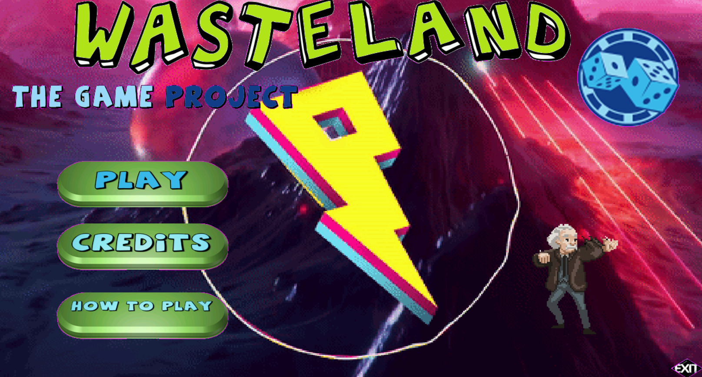
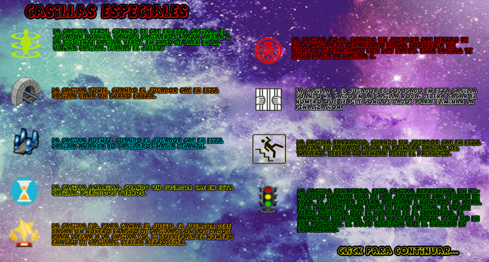
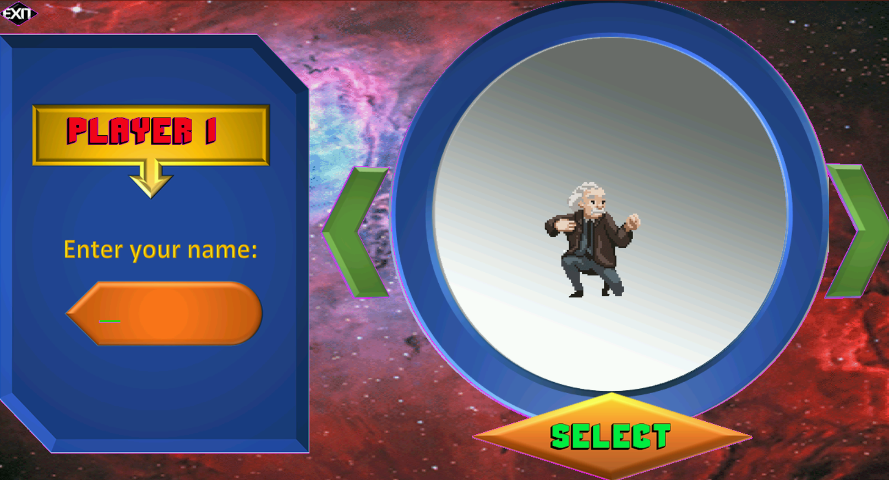
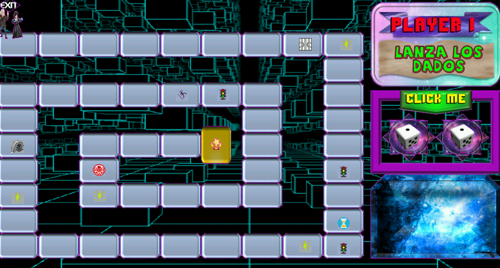

<h1 align="center">WASTELAND</h1>
<p align="center"><i>👾🎶 The C Game Project. Wasteland is a indie turn-based board game made in C</i></p>
<div align="center">
  <a href="https://github.com/TheWorstOne/Wasteland/stargazers"></a>
<a href="https://github.com/TheWorstOne/Wasteland/network/members"></a>
<a href="https://github.com/TheWorstOne/Wasteland/pulls"></a>
<a href="https://github.com/TheWorstOne/Wasteland/issues"></a>
<a href="https://github.com/TheWorstOne/Wasteland/graphs/contributors"></a>
<a href="https://github.com/TheWorstOne/Wasteland/blob/master/LICENSE"></a>
</div>
<br>
<p align="center"><i>Interested in the project? Please visit my <a target="_blank" href="https://mangelladev.web.app/">website</a></i></p>
<br>

<!-- ABOUT THE PROJECT -->
This repository was created as a final project for the Programming II course at the University of Cuenca. The objective of this project was to demonstrate the knowledge acquired in data structures, pointers and matrices by developing a turn-based board game where each square on the board has special characteristics. I made this game early in my student life 🤓, in my freshman year of college 😋. The project was developed in the C language using the Allegro.h interface library.

<p align="center">
    
</p>

<br>

If you like this Repo, Please click the :star:

<!-- TABLE OF CONTENTS -->
## Contents
  - [Getting Started](#getting-started)
  - [Usage](#usage)
  - [Roadmap](#roadmap)
  - [License](#license)
  - [Contact](#contact)
  - [Acknowledgements](#acknowledgements)

  <!-- GETTING STARTED -->
## Getting Started

To get a local copy up and running follow these steps.

### Prerequisites

List of things that you need to have configured for the correct operation of the project.
* Codeblocks
* Allegro library
* Allegro dlls

### Installation

1. Configure Codeblocks IDE, you can help yourself from this [video](https://www.youtube.com/watch?v=pbTY5-LuuJU).
2. Clone the repo
   ```sh
   git clone https://github.com/TheWorstOne/Wasteland.git
   ```
3. Install the [allegro](http://www.mediafire.com/file/b19dbger797rixs/Allegro_en_CodeBlocks.rar/file) library. Follow the steps in this [video](https://www.youtube.com/watch?v=pbTY5-LuuJU).

4. If the game asks for the dlls __alld42.dll__, you can find them in the `root folder` of the project. You must copy and paste them in `C:/Windows/System32` or simply leave them here in the root directory.

<!-- USAGE EXAMPLES -->
## Usage

The objective of the game is to reach the last square on the board before the rest of the players. To win the game you must land exactly on the last green square, or exactly on the last square of the board. If the number obtained with the dice is not exact to the number of squares necessary to land on the last square, the player will roll back the difference of squares between the number obtained by the dice and the missing squares.

1. Opening the game

    In order to enjoy the game, you just have to download the `Wasteland.exe` file and run it, that's all. In case the game asks you for the missing dlls, you can download them from right here.

2. Understanding the special lockers

<p align="center">
    
</p>

   - 👽 The green square teleports you to the next green square. If you land on the last green square then you win the game
   - ⛩ The tunnel box allows you to roll the dice again
   - 🌉 The bridge square allows you to advance 10 squares
   - ⏰ The yellow box makes you lose two turns
   - 🏆 Box 50, to win the game the player must take an exact number of boxes with the dice to reach box 50. If he exceeds the exact number of boxes he must go back
   - 😈 The red square, when a player falls within this square, he is penalized until he gets a number determined with the dice. This box takes the player to box C
   - 🤡 In square C, the player is placed in this square when he has landed on the red square. You must roll a random number with the dice to get out of this box
   - ♿ The ravine square takes a player back to the beginning of the board
   - 🚦 The traffic light box. When the player lands on this box, a mini game is activated where the player must guess 3 random numbers in 3 attempts to get out of that box. Green color means the number is correct. Yellow means the number is in the wrong position. Red means that number should not go

3. Character selection

    After choosing the number of players and the type of map (`Random by default`), the player must select the character they want to play with and enter their name. If the player wishes to enter his own version of the map, he must modify the file `casillas.txt` in the root directory of the project.
   
    <p align="center">
        
    </p>

4. Playing the game
   
    Now, enjoy the game and the nostalgic sounds in midi format that I included. Each player must roll the dice on their turn by clicking the "Click Me" button, and may luck in the Wasteland lead you to glory 👊.

    <p align="center">
        
    </p>


<!-- ROADMAP -->
## Roadmap

See the [open issues](https://github.com/TheWorstOne/Wasteland/issues) for a list of proposed features (and known issues).


<!-- LICENSE -->
## License

Distributed under the MIT License. See `LICENSE` for more information.


<!-- CONTACT -->
## Contact

Miguel Ángel Macías - 👨‍💻[Linkedin](https://www.linkedin.com/in/mangelladev/)

My Personal Website: ✨[mangelladev.com](https://mangelladev.web.app/)


<!-- ACKNOWLEDGEMENTS -->
## Acknowledgements
* [Proximity](https://www.youtube.com/channel/UC3ifTl5zKiCAhHIBQYcaTeg) brand logo
* Science Kombat for the 8 bit character design
* The page where I downloaded the songs in midi format is no longer available 😔. It's a shame, but I will always be grateful to them.


